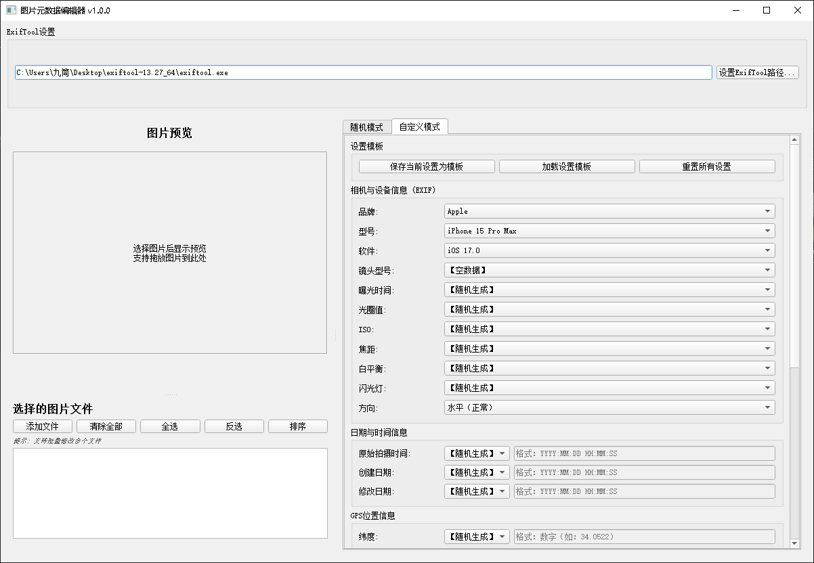
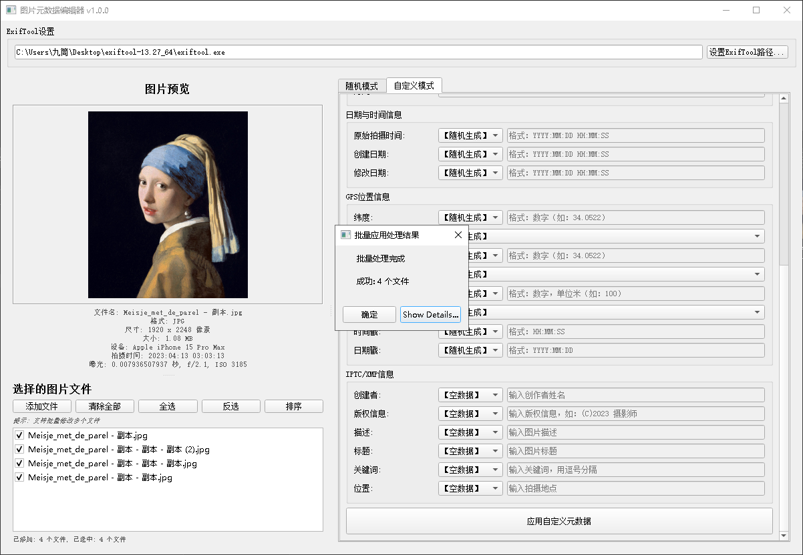
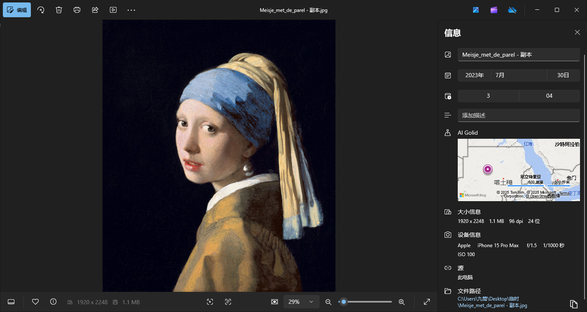

# 图片元数据编辑器

一个用于编辑图片元数据的应用程序，提供随机生成和自定义编辑模式。联系作者：TG@jiutong9999

## 功能特点

- **随机模式**：一键生成合理的随机元数据，每张图片都生成完全不同的随机信息
- **自定义模式**：通过下拉菜单或手动输入修改特定元数据字段
- **批量处理**：同时处理多张图片，提高效率
- **支持修改的元数据**：
  - 相机与设备信息（EXIF）：品牌、型号、软件、镜头、曝光参数等
  - 拍摄时间与日期：原始拍摄时间、创建日期、修改日期
  - 地理位置信息（GPS）：经纬度、高度、时间戳等
  - 图像描述与版权信息（IPTC/XMP）：创作者、版权声明、描述、标题等
- **保存设置模板**：可以保存自定义设置作为默认模板，方便下次使用
- **拖放支持**：支持将图片文件直接拖放到程序中
- **元数据预览**：应用前可预览修改结果
  

## 安装说明

### 方法一：使用启动脚本（推荐）
1. 确保已安装Python 3.6或更高版本
2. 双击运行`start_图片元数据编辑器.bat`，脚本会自动检查并安装所需依赖
3. 首次运行时，可能需要设置ExifTool路径（如果未自动检测到）

### 方法二：手动安装
1. 安装Python 3.6或更高版本
2. 安装所需依赖：
   ```
   pip install PyQt5==5.15.9
   pip install pyexiftool==0.5.5
   pip install pillow==10.0.0
   ```
3. 下载ExifTool（必须）：
   - 从[ExifTool官网](https://exiftool.org/)下载最新版本
   - 解压到任意位置，记住exiftool.exe的路径

## 使用方法

1. 启动程序：
   - 通过启动脚本：双击`start_图片元数据编辑器.bat`
   - 手动方式：运行`python 1.py`
   
2. 在程序首次运行时，设置ExifTool路径：
   - 如果程序未自动找到ExifTool，会提示您手动设置路径
   - 您也可以在界面上使用"设置ExifTool路径..."按钮重新设置
   
3. 点击"添加文件"选择要编辑的图片文件，或直接拖放图片到程序中
4. 选择操作模式：
   - **随机模式**：点击"生成随机元数据"按钮，为每张图片生成不同的随机数据
   - **自定义模式**：设置各字段的值，可选择"随机生成"、"不修改"、"空数据"或自定义输入
5. 预览元数据后确认应用更改
6. 您可以使用"保存为默认设置"按钮保存当前配置，下次启动程序时会自动加载

## 常见问题解决

1. **无法找到ExifTool**：
   - 确保已正确下载ExifTool并解压
   - 在程序界面中设置正确的ExifTool路径
   - ExifTool路径应指向exiftool.exe文件

2. **程序启动失败**：
   - 检查Python版本（需要3.6或更高版本）
   - 确认所有依赖已正确安装
   - 查看命令行输出的错误信息

3. **配置未保存**：
   - 使用"保存为默认设置"按钮（而非"保存设置"）保存配置，确保下次启动时自动加载
   - 配置保存在程序目录下的配置文件中

## 注意事项

- 请在修改前备份重要图片
- 某些图片格式可能不支持全部元数据字段
- 在"随机模式"下，位置、时间等信息完全随机生成，请注意实际使用场景
- 使用本软件修改的元数据仅供个人使用，请尊重版权法律

## 联系方式

Telegram: @jiutong9999 
